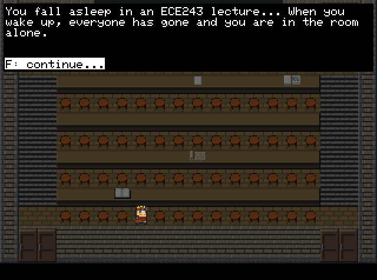
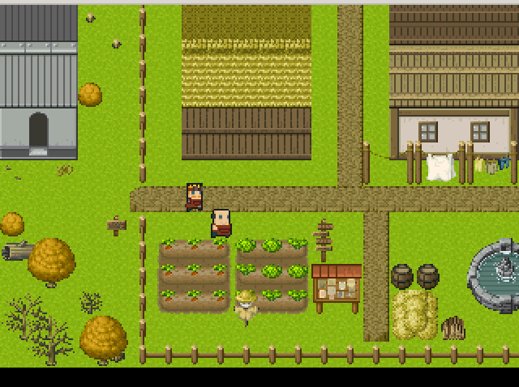
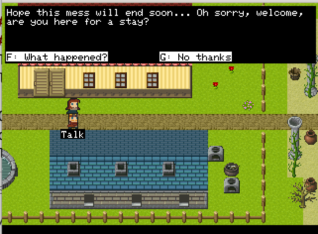
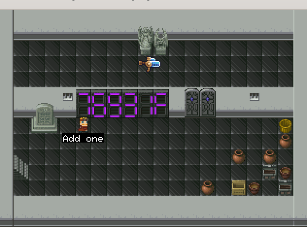

# SimpleRPG on DE1SoC
This is a final project for UofT ECE243 corse, 2022

## Overview
This is a rpg written purely in c and is able to run on the DE1SoC dev board. Some screenshots here:

## How to use
### On desktop
This program includes a simple SDL terminal so you can test it on laptops. You can install the SDL2 lib and build it with cmake.

On linux, you can just install SDL2 lib with package manager and build directly with cmake. On Windows and Mac, you will need to modify the top level `CMakeLists.txt` to indecate where you lib is installed.

### On DE1Soc
Open the `src/proj.amp` with the Monitor program and compile and upload to the board. If that does not work, try creating a new project and add all .c files (except those with sdl in their name, i.e. screen_server_sdl.c etc ) to the project.

## Credits
Pixel arts used in this program are from:

- https://pipoya.itch.io/pipoya-rpg-tileset-32x32
- https://superdark.itch.io/16x16-free-npc-pack
- https://snoopethduckduck.itch.io/guns
- https://penusbmic.itch.io/monster-pack-i

Tilemaps are created using `Tiled`: https://www.mapeditor.org/
